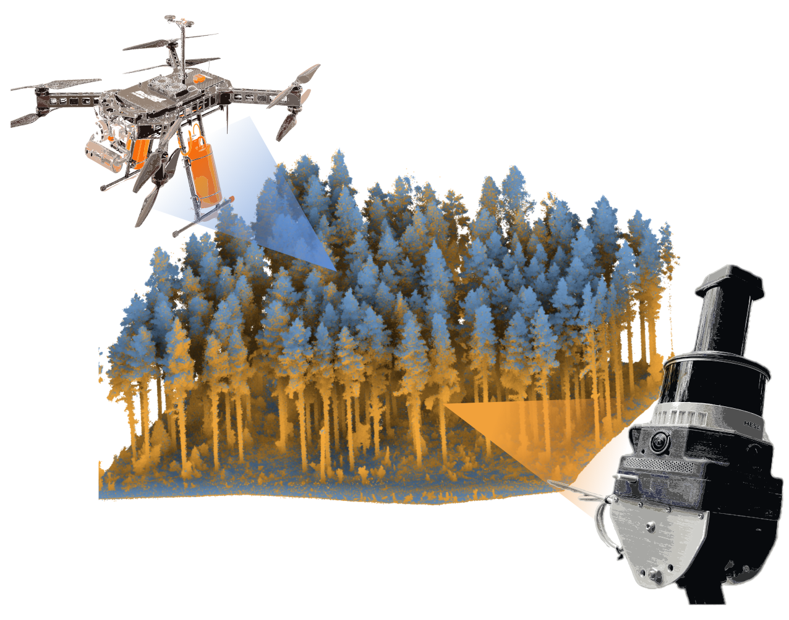

# DigiForest Registration

<p align="center">
  
</p>

The goal of this project is to merge above-canopy aerial and ground point clouds of forests. The aerial point clouds (typically coming from an UAV) are assumed to be of higher accuracy than the ground point clouds. Typically, ground Mobile Laser Scanning (MLS) systems may suffer from drift over the length of its trajectory.
This repository contains the implementation of our paper **Markerless Aerial-Terrestrial Co-Registration of Forest Point Clouds using a Deformable Pose Graph** [[Paper]](https://arxiv.org/abs/2410.09896)

## Setup
The code has been tested on Ubuntu 20.04 and Python 3.8.
There are two ways to install the repository : either manually by cloning it or by installing a wheel file from github's Releases.

### Manual installation

Clone the repository and install it :
```sh
cd digiforest_registration
pip install -e .
```

### Install a wheel file

Download the wheel file and install it:
```sh
pip install ./digiforest_registration-0.1.0-py3-none-any.whl
```


## Point cloud preprocessing
The inputs of the registration pipeline are a MLS (terrestrial) and a UAV (aerial) point clouds. The pipeline implemented in this repository expects the two clouds to be already roughly aligned. By a *rough alignment*, we mean that the x and y displacement offsets between the two clouds should be less than 10 meters. Usually this initial alignment is provided by GPS measurements.
The first step is to make sure that the UAV and MLS clouds are in the same coordinate frame.
If your clouds are in different UTM coordinates frame, you can use the [PDAL](https://pdal.io/en/2.9.0/) python package to convert them to the same frame.
For instance this command with **PDAL** will convert an input in EPSG:2056 to EPSG:25832 :
```sh
pdal translate -i input.las -o output.las  -f filters.reprojection --filters.reprojection.out_srs="EPSG:25832"  --filters.reprojection.in_srs="EPSG:2056"
```

You also need to make sure that the two point clouds have normals. If they don't, you can use [CloudCompare](https://www.cloudcompare.org/) to compute them. The normals are used by the pipeline to extract the ground and the trees. In *CloudCompare* go to *Edit/Normals/Compute*. Settings that seem to work well in most cases are `Local Surface model : Quadric`, `Octree radius : Auto` and `Use preferred orientation: +z`.

Our pipeline only accepts clouds in `ply` format. If your inputs are in a different format, you can use *CloudCompare* to convert them.


## Parameters of the registration pipeline

Inside the `conf` folder you will find an example configuration file `pipeline-registration.yaml`.

* **`uav_cloud`** : Path to the UAV point cloud. [Mandatory]
* **`mls_cloud_folder`** : Path to the folder containing the MLS clouds. [Mandatory]
* **`ground_segmentation_method`** ( default or [csf](https://github.com/jianboqi/CSF) ): Method to use to segment the ground of the clouds. 'Default' should use most of the time.
* **`correspondence_matching_method`** ( graph ) : There is a single method implemented so far to match the features from the UAV and MLS clouds.
* **`mls_feature_extraction_method`** ( canopy_map or tree_segmentation): Method to extract the features of the MLS cloud. 'canopy_map' works well if the canopy is visible in the MLS cloud. If the canopy is not visible, the other method must be used.
* **`offset`** (default [0., 0., 0.]): Translation offset to apply to the MLS clouds. The code won't work well if the coordinates of the point clouds are too large. This parameter allows to translate the cloud to reduce the dimentionality of the coordinates. It's similar to the [global shift](https://www.cloudcompare.org/doc/wiki/index.php/Global_Shift_and_Scale) in Cloud Compare.
* **`mls_registered_cloud_folder`** : Path to the output folder where the registered MLS clouds and the new pose graph will be stored.
* **`debug`** : Set it to True to output debug information about the execution of the pipeline.
* **`save_pose_graph`** : Set it to True to save the pose graph with the additional constraints in the **`output_folder`**.
* **`icp_fitness_score_threshold`** (double): A registration is considered successful if the ICP fitness score of the last ICP registration is lower than this parameter.
* **`min_distance_between_peaks`** (double): Minimum distance between tree's peaks in the point clouds. It's an important parameter. If this parameter is too small, peaks that don't correspond to real tree peaks could be found.
* **`maximum_rotation_offset`** (double): Maximum rotation offset in radians between the MLS and UAV clouds. Increasing this value will make the search space larger and the registration will take longer. You can consider lowering this value if you observe that there is no rotation offset between the clouds.
* **`correspondence_graph_distance_threshold`** (double): Maximum distance threshold to consider two edges as similar in the correspondence graph. 

## Parameters of the optimization pipeline
The registration and optimization steps share the same configuration file. Below are the parameters specifics to the optimization

* **`pose_graph_file`** : Path to the pose graph file generated by the registration pipeline. It should be stored inside `mls_registered_cloud_folder`.
* **`optimized_cloud_output_folder`** : Path to the output folder where the optimized mls clouds and the optimized pose graph will be saved.
* **`debug`** : Set it to True to output debug information about the pose graph and the pose graph optimization.
* **`load_clouds`** : Set it to True to load the point clouds stored inside the **`mls_cloud_folder`** folder. Depending on the number of clouds, it can take a significant amount of time to load them.
* **`noise_matrix`** : Upper triangular elements of the matrix of the 6*6 noise covariance matrix to apply to the MLS clouds.


## Execution of the registration pipeline

Our pipeline has **two** stages: 1) (Initial) Registration and 2) (Pose-Graph) Optimization. 

The registration stage computes a rigid transformation between each MLS point cloud to the aerial point cloud using tree locations. This step should closely align the MLS point clouds to the aerial point cloud. The optimization step further refines the registration process by integrating additional constraints in-between MLS point clouds, yielding a better registration estimate as the drift in MLS estimates are minimized.  

Our pipeline can accept MLS point cloud, either provided as one single pointcloud, or as a collection of point clouds (payloads) created by a SLAM system.

### Tile creation
If your input MLS cloud is a single point cloud. For our method to work, we cut this cloud in *tiles* and create a simple pose graph where the nodes of the pose graph are the center of the tiles. Please refer to the paper for more information.
Use the following command to create the tiles :

```sh
tiling --cloud input_mls_cloud.ply --output_folder output --tile_size 20 --offset -399200 -6785900 0
```
This command takes one input cloud, translates it using the `offset` provided (see the description of the parameters of the registration pipeline above), and saves the tiles in the `output_folder`. With your data you will have to choose an appropriate offset.

### Registration execution

Inside the `config` folder, you can find a configuration file `registration-pipeline.yaml` containing all the parameters that you need to set. Edit the parameters that you need and run the registration with :
 
```sh
registration_script --config ../config/registration-pipeline.yaml 
```

At the end of execution, it will display the final icp fitness score for each MLS clouds and whether the registration is considered as successful or not for these individual clouds. A registration is considered successful solely on this fitness score and the **`icp_fitness_score_threshold`** set in your yaml file.

### Execution of the optimization pipeline

Inside the `config` folder, there is the file `optimization.yaml` containing all the parameters that you need to set.
Run the optimization with:

```sh
optimization --config ../config/registration-pipeline.yaml
```

### Example dataset
We provide a small [dataset](https://drive.google.com/drive/u/0/folders/13oNJS5qsoNYkJzNBXBWpAf0FpkaFOr-H) that you can download to test the registration. It consists of 6 tiles clouds and a UAV cloud.
* Open `./config/registration-pipeline-example-dataset.yaml` and modify the absolute path to the inputs and to the output folders.
* Run the registration. It succeeds for 3 tiles. The registered clouds are saved inside `mls_registered_cloud_folder`.
* Run the optimization. The optimized clouds are saved inside `optimized_cloud_output_folder`. After optimization, all the tiles are perfectly aligned with the aerial point cloud.

## Troubleshooting

* If a registration isn't successful, and you would like to understand why, set **`debug`** to `True` in your configuration file. The program will display additional information about each step of the algorithm (refer to the paper for a detailed explanation of each step).


